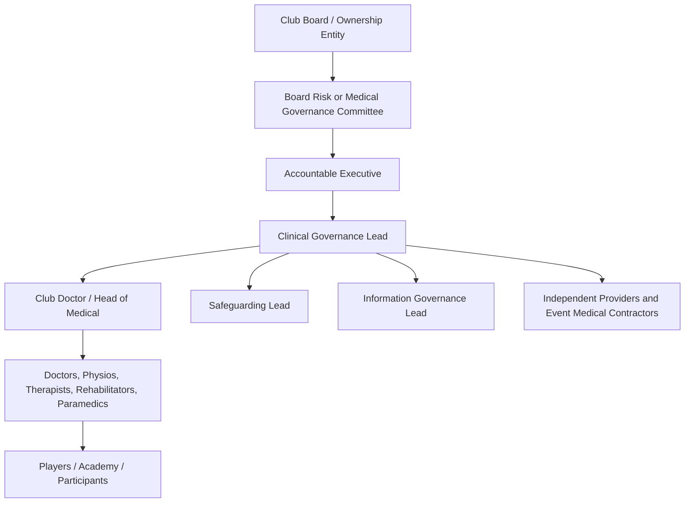

# Governance Operating Model

## Board-to-clinical structure

## Standing governance forums

| Forum | Frequency | Core business |
| --- | --- | --- |
| Medical governance committee | Monthly in season, quarterly out of season | Risk register, incidents, complaints, audits, safeguarding, concussion, contractor reports. |
| Match/event medical review | Every home fixture or event block | Cover, equipment, incidents, transfers, learning actions. |
| Concussion and return-to-play review | As cases arise, with periodic audit | Protocol compliance, clinical sign-off, recurrence, player communication. |
| Contractor quality review | Quarterly or contract-defined | Registration/exemption status, credentials, incidents, records, audit results. |
| Board assurance report | Quarterly | Top risks, compliance status, serious incidents, trends, resources, decisions needed. |

## Core policies

- clinical governance and accountability;
- scope of service and eligibility;
- consent and confidentiality;
- medical records and retention;
- data protection and information sharing with coaching/performance staff;
- safeguarding children and adults at risk;
- chaperones and intimate examinations;
- concussion, head injury, and return to play;
- emergency action and ambulance transfer;
- medicines management, prescribing, injections, and storage;
- infection prevention and control;
- equipment maintenance and emergency-kit checks;
- incident reporting, serious incident review, and learning;
- complaints and concerns;
- duty of candour where regulated care is provided;
- contractor approval and monitoring;
- clinician credentialing, induction, supervision, and CPD;
- business continuity and major incident response.

## Board assurance template

The board should receive a concise dashboard with:

- a five-domain CQC-style view: safe, effective, caring, responsive, and well-led;
- current CQC scope assessment and any service changes;
- RFL medical standards compliance;
- medical risk register top five;
- staffing and credential compliance;
- incidents, near misses, concussions, emergency transfers, and themes;
- complaints, concerns, safeguarding, whistleblowing, and duty-of-candour cases;
- audit results and overdue actions;
- contractor registration/exemption status;
- medicines/equipment exceptions;
- decisions needed from the board.

## Five-domain dashboard

| Domain | Suggested board indicators |
| --- | --- |
| Safe | Incidents, near misses, safeguarding, concussion events, emergency transfers, medicines exceptions, equipment and premises checks, staffing gaps. |
| Effective | Clinical audit, referral timeliness, return-to-play outcomes, reinjury rates, evidence-based protocol compliance, consent audit. |
| Caring | Player feedback, confidentiality concerns, dignity/chaperone audit, clinical independence concerns, clinician wellbeing. |
| Responsive | Complaints and concerns, access delays, academy/family information, equality issues, pathway delays with external providers. |
| Well-led | Risk register movement, overdue actions, contractor assurance, credential compliance, governance meeting attendance, board decisions and escalations. |

## Red flags

Escalate immediately if any of these occur:

- medical services are offered to the public without a CQC scope assessment;
- diagnostics or procedures are added without identifying the regulated activity and provider;
- no written contract identifies clinical control for outsourced services;
- clinicians work without verified professional registration, indemnity, or scope of practice;
- coaches or executives override clinical return-to-play decisions;
- records are incomplete, inaccessible, or mixed into performance systems without controls;
- incidents are discussed informally but not logged, investigated, or closed;
- academy or child-player care lacks safeguarding and consent controls;
- premises or emergency equipment checks lapse.

## Implementation roadmap

1. Create a complete inventory of all medical services, locations, providers, and user groups.
2. Run the registration decision model for each service.
3. Put immediate controls around any public, diagnostic, prescribing, remote-triage, injection, IV, or clinic-like activity.
4. Approve a medical service statement of purpose.
5. Establish the medical governance committee and risk register.
6. Build the evidence pack and dashboard.
7. Review contractor contracts and registration/exemption evidence.
8. Audit records, consent, concussion, equipment, and clinician credentials.
9. Report quarterly to the board and annually refresh the CQC scope analysis.

Use [Assurance Pack Templates](assurance-pack-templates.md) for the practical document set.
