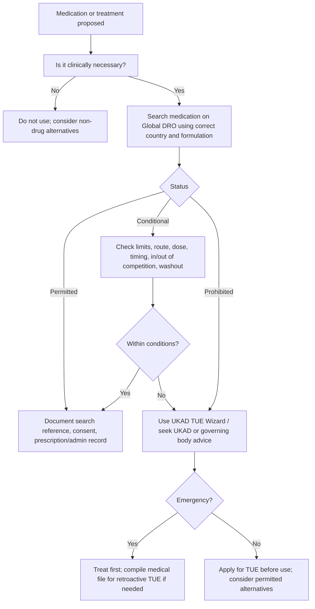

# Medicines, Prescribing, and Anti-Doping

## Why this is high risk

Medicines sit at the sharpest interface between CQC governance, professional duties, player welfare, and anti-doping. A club medical department may hold emergency medicines, prescribe or administer pain relief, use injections, manage asthma medication, advise on supplements, handle concussion medication restrictions, and support Therapeutic Use Exemption (TUE) applications through [UKAD's medicine and TUE guidance](https://www.ukad.org.uk/medicine).

The governance aim is simple: no medicine should be prescribed, supplied, stored, administered, reported, or disclosed unless the club can explain the clinical indication, professional authority, anti-doping status, consent, record, and follow-up.

## CQC medicines optimisation standard

CQC's [medicines optimisation quality statement](https://www.cqc.org.uk/guidance-regulation/providers/assessment/single-assessment-framework/safe/medicines-optimisation) expects medicines and treatments to be safe and to meet people's needs, capacities, and preferences. The statement covers involvement in medicines decisions, best practice, lawful prescribing/supply/administration, accurate medicines information during transfers of care, and controlled-drugs oversight.

For a Rugby League club this means:

- medicines are clinically indicated, not used to serve selection or convenience;
- players understand risks, benefits, alternatives, anti-doping status, and follow-up;
- prescribing is within professional scope and based on adequate assessment;
- regular and acute medicines are recorded in the clinical record;
- medicines information follows the player across club, hospital, GP, specialist, loan, and national-team pathways where lawful and necessary;
- emergency medicines are checked, in date, stored appropriately, and reviewed after use;
- controlled drugs or medicines liable to abuse/misuse have additional safeguards.

## RFL anti-doping controls

The [RFL Medical Standards 2026](https://www.rugby-league.com/uploads/docs/Medical%20Standards%202026.pdf) require medical staff to be aware of anti-doping rules and the WADA Prohibited List. They make checking medication and supplements mandatory. They direct use of [Global DRO through UKAD's Search Check Apply process](https://www.ukad.org.uk/searchcheckapply) for medicines and highlight that supplements cannot be checked the same way because they are not licensed medicines.

Professional players are treated as being in the UKAD National TUE Pool under the RFL standards, so TUE timing matters. If a medication contains a prohibited substance and there is clinical need, a TUE may be needed before use except in emergencies or defined retroactive scenarios. The RFL's [anti-doping page](https://www.rugby-league.com/governance/rules-and-regulations/anti-doping-integrity-betting) is the sport-specific reference point.

## Club medicines governance model

### 1. Medicines formulary and scope

Maintain a club medicines formulary:

- emergency medicines required by RFL mandatory equipment/drugs box;
- medicines carried by the club doctor;
- medicines supplied or administered by physiotherapists or other clinicians;
- medicines held for travel;
- oxygen and medical gases;
- topical products, wound-care products, local anaesthetic, analgesia, asthma medication, glucose products, and cardiac/emergency medicines;
- controlled drugs or high-risk medicines, if any.

Each medicine should state:

- indication;
- legal classification;
- who may prescribe, supply, administer, or support self-administration;
- storage condition;
- expiry check frequency;
- documentation requirement;
- anti-doping check requirement;
- TUE implication;
- emergency escalation route.

### 2. Prescribing and administration controls

Minimum controls:

- prescribe only after adequate assessment and access to relevant medical history where needed, consistent with [GMC prescribing guidance](https://www.gmc-uk.org/professional-standards/the-professional-standards/good-practice-in-prescribing-and-managing-medicines-and-devices);
- check allergy status, current medication, contraindications, and interaction risk;
- check Global DRO before prescribing or advising use where anti-doping applies;
- check whether the player needs a TUE using UKAD guidance or the TUE Wizard;
- document dose, route, batch where relevant, indication, consent, advice, and follow-up;
- inform the player's GP or regular clinician where necessary and with appropriate consent;
- review medicines after emergency use, adverse effects, or transfer of care;
- report adverse drug reactions and device incidents through appropriate clinical governance and MHRA Yellow Card routes where relevant.

### 3. Anti-doping decision flow

## IV products and injections

This is a red-flag area for both CQC and anti-doping:

- CQC can treat IV administration of prescription-only or wellness products as registrable treatment where it is delivered by or under a listed healthcare professional and claimed to alter physiological state.
- RFL standards state that intravenous infusions are prohibited at all times except in specified legitimate medical situations such as emergency intervention, blood replacement, surgical procedures, or administration where other routes are unavailable, and not for exercise-induced dehydration.
- Injections may be permitted as a method if the substance is not prohibited and volume limits are met, but the clinical governance and anti-doping checks still apply.

Club control:

- no IV wellness, recovery, hydration, or performance service without board approval, CQC scope review, UKAD review, and medical governance sign-off;
- every injection must have indication, consent, anti-doping check, route, dose, volume, batch where relevant, clinician, and follow-up recorded;
- any glucocorticoid, beta-2 agonist, opioid analgesic, stimulant, hormone, or controlled drug should trigger enhanced review.

## Supplements

UKAD warns in its [supplement risk guidance](https://www.ukad.org.uk/athletes/managing-supplement-risks) that no supplement can be guaranteed free of prohibited substances. A club should:

- require documented need assessment before supplement use;
- prefer food-first nutrition and clinician/dietitian review;
- use batch-tested products where supplements are used;
- record batch number, supplier, date, player, rationale, and risk discussion;
- make clear that strict liability remains with the athlete;
- avoid coaches, sponsors, or commercial partners introducing supplements outside the medical/nutrition governance route.

## Concussion-specific medication control

The RFL standards require doctors to consider whether pharmacological agents or medicines may mask or modify concussion symptoms when determining symptom-free status. Governance controls:

- record all medication taken after head injury;
- advise against medicines that mask deterioration unless clinically justified;
- include medication review before GRTP progression;
- include medication status on return-to-play sign-off;
- document player advice about driving, alcohol, sedating medication, and escalation.

## Board assurance questions

- Is there a named medicines lead?
- Is the mandatory drugs box complete, checked, in date, and reconciled?
- Are controlled drugs present? If yes, is the Home Office and governance position clear?
- Are all prescribing clinicians working within scope and indemnity?
- Are Global DRO checks and TUE decisions recorded?
- Are emergency medicines reviewed after use?
- Are adverse incidents and near misses reviewed?
- Are players given enough information to make informed choices?
- Are supplement risks governed through medical/nutrition, not performance pressure?

## Related pages

- [CQC Registration Edge Cases](cqc-registration-edge-cases.md) explains when prescribing, injections, IV services and medicines administration can become registration questions.
- [RFL Medical Standards Map](rfl-medical-standards-map.md) identifies the RFL controls that feed into medicines assurance.
- [Assurance Pack Templates](assurance-pack-templates.md#7-medicines-and-anti-doping-log) includes a medicines and anti-doping log.

## Sources

- [CQC: Medicines optimisation](https://www.cqc.org.uk/guidance-regulation/providers/assessment/single-assessment-framework/safe/medicines-optimisation)
- [CQC: Treatment of disease, disorder or injury](https://www.cqc.org.uk/guidance-regulation/providers/registration/scope-registration/regulated-activities/treatment-disease-disorder-or-injury)
- [CQC: Register as a provider](https://www.cqc.org.uk/guidance-regulation/registration/register-provider)
- [RFL: Medical Standards 2026 PDF](https://www.rugby-league.com/uploads/docs/Medical%20Standards%202026.pdf)
- [RFL: Anti-Doping](https://www.rugby-league.com/governance/rules-and-regulations/anti-doping-integrity-betting)
- [UKAD: Medicine and TUE Hub](https://www.ukad.org.uk/medicine)
- [UKAD: Search Check Apply](https://www.ukad.org.uk/searchcheckapply)
- [UKAD: Managing Supplement Risks](https://www.ukad.org.uk/athletes/managing-supplement-risks)
- [GMC: Good practice in prescribing and managing medicines and devices](https://www.gmc-uk.org/professional-standards/the-professional-standards/good-practice-in-prescribing-and-managing-medicines-and-devices)
