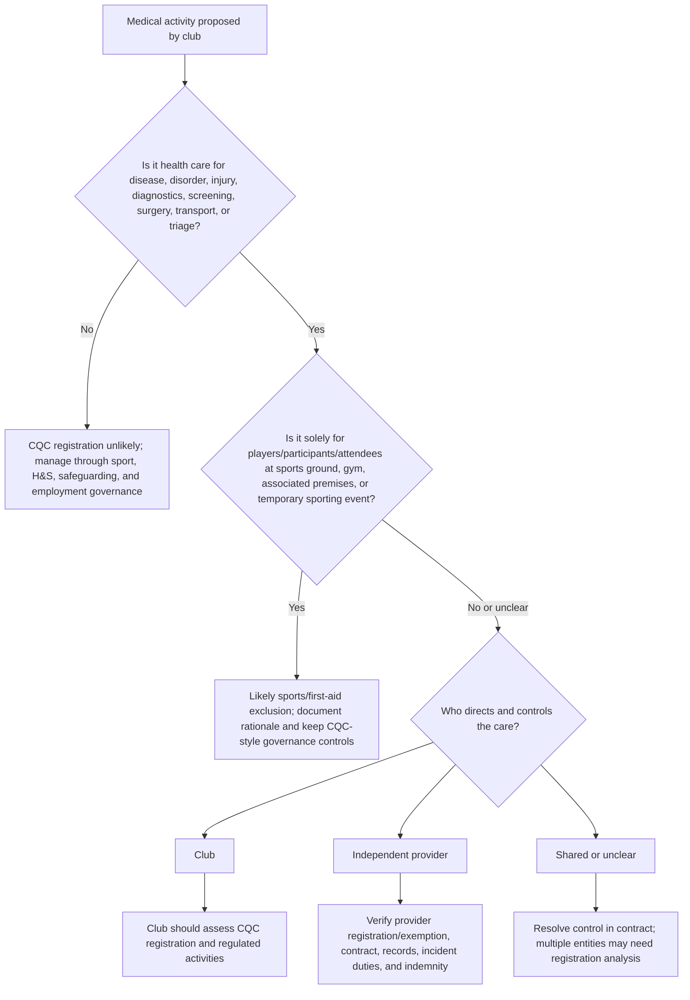

# Professional Rugby League Application

## Starting point

Professional Rugby League medical services are sophisticated healthcare environments, even when delivered for a closed athlete population. The [Rugby Football League (RFL) medical management guidance](https://www.rugby-league.com/governance/medical/medical-management) describes professional game medical provision as including at least one Immediate Medical Management on the Field of Play (IMMOFP) qualified doctor at professional games, with physiotherapists, sports rehabilitators, and therapists also undergoing field-of-play training.

The governance challenge is that sports regulation, employment obligations, athlete welfare, and healthcare regulation overlap but do not fully substitute for each other.

## CQC sports exclusions

CQC's scope guidance for [Treatment of disease, disorder or injury](https://www.cqc.org.uk/guidance-regulation/providers/registration/scope-registration/regulated-activities/treatment-disease-disorder-or-injury) expressly excludes:

- first aid delivered by healthcare professionals in unexpected or potentially dangerous situations requiring immediate action;
- first aid by trained non-healthcare professionals;
- first aid by organisations established for first-aid provision;
- treatment provided in a sports ground or gymnasium, including associated premises, where it is solely for people taking part in or attending sporting activities and events;
- treatment provided through temporary arrangements for sporting or cultural events.

That exclusion is central. A professional Rugby League club is less likely to need CQC registration merely because it provides pitch-side emergency care, match-day doctor cover, or training-ground treatment solely for players and attendees within the sports-ground/event context. The edge cases around public clinics, diagnostics, remote advice and contractor control are set out in [CQC Registration Edge Cases](cqc-registration-edge-cases.md).

## Where CQC risk can re-enter

The sports exclusion is not a blanket immunity for all healthcare run by a club. CQC's [scope of registration](https://www.cqc.org.uk/guidance-regulation/providers/registration/scope-registration) should be reassessed if the club does any of the following:

- runs a clinic for members of the public, staff, sponsors, academy parents, schools, or other third parties;
- charges for physiotherapy, sports medicine, diagnostics, injections, screening, or rehabilitation outside the club's participant/attendee population;
- operates treatment from premises that function as a private clinic rather than a sports ground, gymnasium, or associated sports premises;
- provides remote triage, medical advice, or treatment plans as a service beyond match/training participation;
- carries out diagnostic and screening procedures as a sole or main activity;
- arranges imaging, blood tests, injections, prescribing, or minor procedures under the club's own clinical governance rather than merely referring to an external registered provider;
- contracts clinicians but retains direction and control over regulated healthcare activities;
- provides services to children or academy players in a way that raises both healthcare and safeguarding governance obligations.

## Rugby League governance already in place

The [RFL Medical Standards 2026](https://www.rugby-league.com/uploads/docs/Medical%20Standards%202026.pdf) create useful governance inputs:

- IMMOFP and iIMMOFP training routes;
- professional registration expectations for doctors, physiotherapists, paramedics, sports therapists, and sports rehabilitators;
- indemnity expectations for working in sport;
- concussion rules, return-to-play protocols, and reporting, supported by the RFL's [concussion guidance](https://www.rugby-league.com/governance/medical/concussion/concussion-statement);
- clinical groups and CPD activity;
- first-aider registration and match-day monitoring in the community game.

These are strong sport-specific controls. The CQC-style gap is that they do not, by themselves, prove that the club has a full healthcare provider governance system covering legal entity accountability, regulated activity scope, clinical records, complaints, duty of candour, audit, risk management, data protection, premises, equipment, medicines, and provider-level board assurance. The [RFL Medical Standards Map](rfl-medical-standards-map.md) converts those controls into CQC-style evidence.

## Applied governance map

| Club medical activity | Likely CQC posture | Governance control |
| --- | --- | --- |
| Pitch-side emergency treatment during fixtures | Usually within first-aid or temporary sporting-event exclusion | Event medical plan, IMMOFP rota, equipment checks, incident log, escalation to ambulance/ED. |
| Training-ground player treatment in club medical room | Likely sports-ground/gym exclusion if solely for participants and associated premises | Medical-room SOPs, records, consent, safeguarding, concussion protocol, medicines control. |
| Rehabilitation for contracted players only | Often sports participant context, but check premises and clinical control | Rehab governance, clinical supervision, scope of practice, outcomes and re-injury audit. |
| Private sports clinic open to public | Likely CQC assessment needed if regulated activity is provided | Treat as independent healthcare provider; register if no exemption applies. |
| Diagnostic ultrasound, imaging, blood testing, cardiac screening | Potential diagnostic/screening regulated activity depending on model | Decide who is provider; use CQC-registered diagnostic provider or register. |
| Club doctor prescribing/injections for players | May be covered if within sports-ground participant treatment, but high governance risk | Prescribing policy, PGDs where relevant, medicines storage, consent, adverse incident review. |
| Academy medical care for children | Sports exclusion may still matter, but safeguarding bar is higher | Safeguarding lead, parental consent, chaperones, DBS, child records, escalation routes. |
| Contracted event medical company | Provider may be contractor, club, or both depending on control | Contract must state clinical control, registration status, standards, records, incidents, indemnity. |

## Decision diagram

## Practical conclusion

For a professional Rugby League club, the prudent position is not "CQC never applies to sport." It is:

1. Core pitch-side and participant-only care may be excluded from CQC registration.
2. Wider private healthcare, diagnostics, and clinic-style services can fall back into CQC scope.
3. Even where excluded, CQC governance standards are a useful benchmark for quality, safety, and board assurance.

## Related pages

- [CQC Governance Baseline](cqc-governance-baseline.md) explains the provider-registration foundation.
- [Medicines, Prescribing, and Anti-Doping](medicines-prescribing-anti-doping.md) covers the highest-risk treatment interface.
- [Assurance Pack Templates](assurance-pack-templates.md) provides the scope assessment, incident, contractor, and concussion templates.

## Key sources

- [CQC: Scope of Registration Guidance May 2022, Treatment of disease, disorder or injury exclusions](https://www.cqc.org.uk/sites/default/files/2022-05/20220517%20Scope%20of%20Registration%20Guidance%20May%202022.pdf)
- [RFL: Medical Management](https://www.rugby-league.com/governance/medical/medical-management)
- [RFL: Concussion Statement](https://www.rugby-league.com/governance/medical/concussion/concussion-statement)
- [Fieldfisher: Sports organisations and CQC registration](https://www.fieldfisher.com/en/services/public-and-regulatory/public-regulatory-law-blog/sports-organisations-and-cqc-registration)
